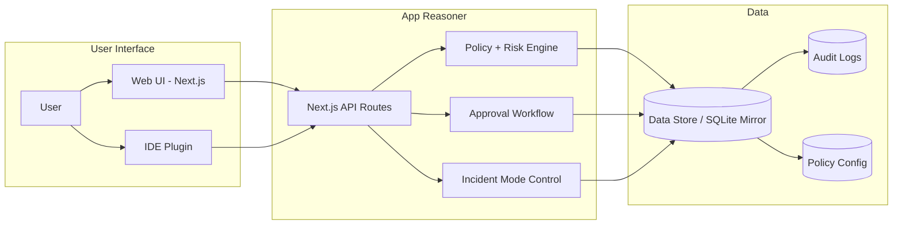

# CEEES Deep Learning Week Hackathon 2026 Project


Track 1 implementation: a safe, human-governed AI coding agent with:

- `ide-plugin/`: VS Code extension for AI tasks + local guardrails
- `guardian-web/`: dashboard and backend APIs for approvals, incident mode, policy, audit
- `demo/`: end-to-end demo scripts and scripted scenarios
- `sqlite/`: SQLite schema for backend mirror persistence

## Start Here

Use this file as the canonical setup/run guide.
Module-specific details live in:

- `guardian-web/README.md`
- `ide-plugin/README.md`
- `demo/README.md`

Historical planning material is in `Planning/` and is not the source of truth for current runtime setup.

## Documentation Map

- `README.md`: canonical cross-platform setup + run
- `project_documentation.md`: submission-focused methodology/results/testing document (Markdown draft for final PDF conversion)
- `testbench/README.md`: grader entry point for setup/run validation
- `testbench/setup-and-run.md`: step-by-step setup and execution guide for graders
- `testbench/test-cases.md`: structured manual validation scenarios and expected behavior
- `guardian-web/README.md`: dashboard/backend module guide
- `ide-plugin/README.md`: extension module guide
- `demo/README.md`: demo execution guide
- `demo/USECASES.md`: scripted live demo path
- `docs/backend-storage-features.md`: storage feature mapping (legacy Supabase intent -> SQLite implementation)
- `docs/mermaid.md`: architecture diagram (Mermaid source for documentation and GitHub rendering)
- `docs/README.md`: docs index/maintenance notes
- `Planning/README.md`: index of historical planning docs

## Architecture Diagram



Primary editable architecture source: `docs/mermaid.md`

## Dependency Checklist (Computer-Agnostic)

### Required

- `git`
- Node.js `22.x` and npm
- VS Code

Reason for Node 22: backend mirror uses Node built-in `node:sqlite`.

### Required For Shell Scripts

- `bash`
- `curl`
- `jq`
- `uuidgen`

Needed by:

- `guardian-web/scripts/test-integration-flow.sh`
- `demo/scripts/*.sh`

### Optional

- VS Code CLI `code` in PATH (used by `demo/scripts/open-plugin-dev-host.sh`)

## Verify Toolchain

```bash
node -v
npm -v
git --version
code --version
curl --version
jq --version
uuidgen
```

If `code` is unavailable, run extension host via VS Code `F5`.

## Install Dependencies

### macOS/Linux/Git Bash

```bash
cd guardian-web && npm ci
cd ../ide-plugin && npm ci
cd ..
```

### Windows PowerShell

```powershell
Set-Location guardian-web; npm ci
Set-Location ../ide-plugin; npm ci
Set-Location ..
```

## Run Locally

### 1) Start dashboard/backend

```bash
cd guardian-web
npm run dev
```

Runs on `http://localhost:3000` by default.

### 2) Build plugin

```bash
cd ../ide-plugin
npm run build
```

### 3) Start extension development host

Option A (script):

```bash
bash demo/scripts/open-plugin-dev-host.sh
```

Option B (manual):

1. Open `ide-plugin/` in VS Code.
2. Press `F5`.
3. Run `Extension` launch target.

### 4) Configure workspace settings in extension host

```json
{
  "aiGov.backendUrl": "http://localhost:3000",
  "aiGov.apiKey": "",
  "aiGov.requestedBy": "demo-presenter",
  "aiGov.pollIntervalMs": 3000
}
```

`aiGov.backendUrl` accepts either:

- `http://localhost:3000`
- `http://localhost:3000/api`

The plugin normalizes both.

### 5) Run demo scenarios

Follow `demo/USECASES.md`.

## SQLite Backend Mirror

Initialized automatically by `guardian-web`.

- default path: `guardian-web/.data/backend-mirror.sqlite`
- override path: `SQLITE_DB_PATH`

Example:

```bash
SQLITE_DB_PATH=.data/custom-backend.sqlite npm run dev
```

Reference schema: `sqlite/migrations/0001_init.sql`

## API Surface

### Plugin-facing routes

- `POST /generate-plan`
- `POST /approvals`
- `GET /approvals/:approvalId/decision`
- `GET /approvals/:approvalId/events`

### Compatibility routes

- `POST /api/ai/plan`
- `POST /api/approvals`
- `GET /api/audit`
- `GET /api/audit?view=compact`

## Validation Commands

### guardian-web

```bash
cd guardian-web
npm run lint
npm run build
```

### ide-plugin

```bash
cd ide-plugin
npm run build
npm test
```

### end-to-end integration checks

Requires `bash`, `curl`, `jq`, `uuidgen` and running dashboard.

```bash
cd guardian-web
BASE_URL=http://localhost:3000 npm run test:integration
```

## Reset State

Reset local mock CR/audit store:

```bash
bash demo/scripts/reset-demo-state.sh
```

Reset SQLite mirror:

- delete `guardian-web/.data/backend-mirror.sqlite`

## Troubleshooting

### Plugin says backend approval service is not configured

1. Confirm `guardian-web` is running on `http://localhost:3000`.
2. Check workspace setting `aiGov.backendUrl`.
3. Reload extension host window after settings change.
4. Rebuild plugin:

```bash
cd ide-plugin
npm run build
```

### Missing `bash` / `jq` / `uuidgen` on Windows

Use Git Bash or WSL for script-based flows.
