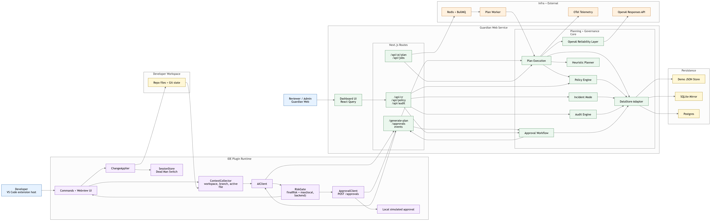
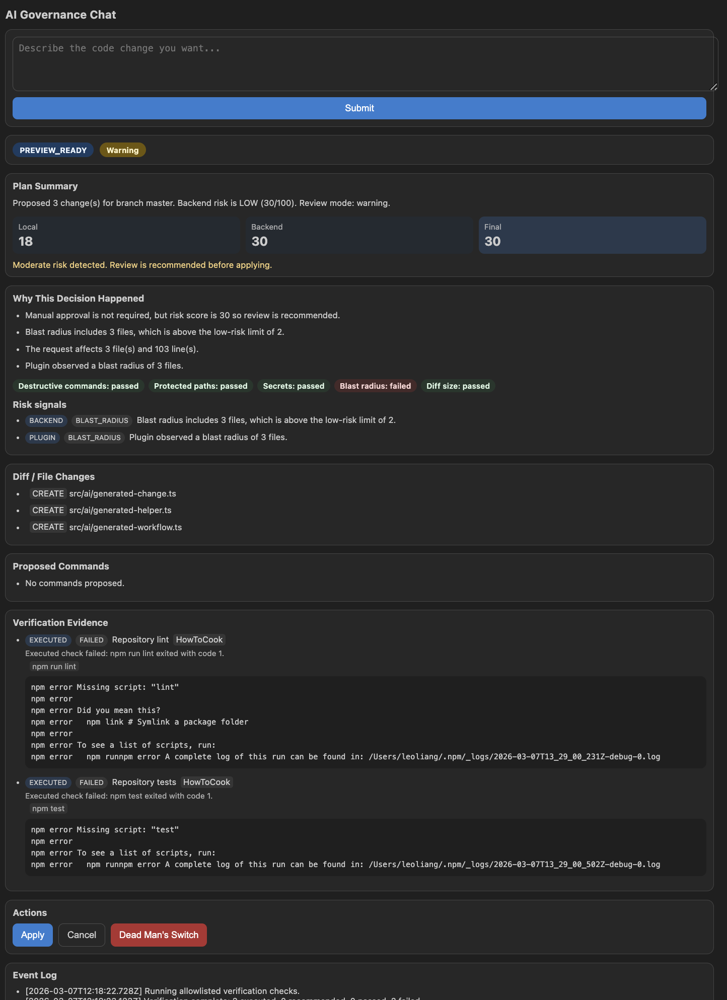

# CEEES Deep Learning Week Hackathon 2026 Project


Track 1 implementation: a safe, human-governed AI coding agent with:

- `ide-plugin/`: VS Code extension for AI tasks + local guardrails
- `guardian-web/`: dashboard and backend APIs for approvals, incident mode, policy, audit
- `sqlite/`: SQLite schema for demo/compatibility mirror persistence

Backend now supports:

- `BACKEND_MODE=demo`: JSON + SQLite mirror
- `BACKEND_MODE=prod`: Postgres (Prisma) + Redis/BullMQ + async plan worker
- OpenAI structured planning reliability layer + eval gate + OTel hook

## Start Here

Use this file as the canonical setup/run guide.
Module-specific details live in:

- `guardian-web/README.md`
- `ide-plugin/README.md`

## Governance Highlights

### Review Modes

| Mode | Trigger | What it enables |
| --- | --- | --- |
| `auto_approved` | score `< auto_approve_below` and all guardrails pass | safe fast path for trivial changes without reviewer wait time |
| `warning` | moderate risk, but no protected-path, secret, or destructive-command guardrail hit | visible caution with full rationale while still allowing progress |
| `approval_required` | high risk, protected path, destructive command, or secret signal | human approval gate before code can be applied |
| `blocked` | deny rule matched | hard stop for unsafe classes of changes such as direct production infra edits |

### New In This Version

- Explainable review decisions: plans now return `review.mode`, rationale lines, matched policy rules, and guardrail pass/fail signals. The plugin and dashboard both show "Why this decision happened" with local, backend, and final risk context.
- Defensible low-risk automation: the backend only auto-approves when the score is below the configured threshold and no destructive commands, protected paths, secret detections, large blast radius, or oversized diffs are present.
- Real RBAC and dual approval: dashboard actions now use authenticated demo actors, scores at or above the default `require_dual_approval_above=85` threshold need two distinct reviewers, and audit logs record the actual actor identity and role.
- Executed verification evidence: the plugin runs allowlisted repo checks when available and attaches the results to the CR so reviewers see executed `lint` and `test` evidence instead of placeholders.
- Runtime posture visibility: the dashboard now shows whether the service is running in `demo` or `prod`, whether the async queue is enabled, and which datastore is active.

### What This Enables

- Faster demos and safer day-to-day use because small changes can move immediately with an audit trail explaining why.
- Enterprise-style governance because approvals, policy edits, and incident mode actions now enforce role boundaries instead of trusting free-form names.
- More trustworthy review conversations because reviewers can see the exact risky path, command, guardrail miss, and verification evidence behind each decision.
- Cleaner operational storytelling because the runtime card makes it obvious whether the team is demonstrating the lightweight demo stack or the full production path.

## Documentation Map

- `README.md`: canonical cross-platform setup + run
- `project_documentation.md`: submission-focused methodology/results/testing document (Markdown draft for final PDF conversion)
- `testbench/README.md`: grader entry point for setup/run validation
- `testbench/setup-and-run.md`: step-by-step setup and execution guide for graders
- `testbench/test-cases.md`: structured manual validation scenarios and expected behavior
- `guardian-web/README.md`: dashboard/backend module guide
- `ide-plugin/README.md`: extension module guide
- `docs/backend-storage-features.md`: storage feature mapping (legacy Supabase intent -> SQLite implementation)
- `docs/backend-eval-benchmarks.md`: eval-gate benchmark table (before/after)
- `docs/mermaid.md`: architecture diagram (Mermaid source for documentation and GitHub rendering)
- `docs/README.md`: docs index/maintenance notes

## Architecture Diagram



Primary editable architecture source: `docs/mermaid.md`  
Final exported diagram used in this README: `.github/assets/haloop-architecture-final.png`

## Preview

### Demo Video
[](https://www.youtube.com/watch?v=cy96VRtIqiA&t=32s)

### Screenshots

**Main Dashboard**  
  
*Central hub for tracking AI-generated change requests and approval statuses.*

**Policy Management**  
  
*Define security boundaries and automated human review triggers.*

**Audit Trail**  
  
*Comprehensive logs of all AI interactions and governance decisions.*

**VS Code Plugin Integration**  
  
*In-IDE guidance showing real-time risk levels and pending approvals.*

**AI Governance Chat**  
  
*AI assistive analysis that explains governance signals, risk rationale, and recommended next actions for the developer.*

**Backend Processing Logs**  
  
*Technical view of the risk evaluation engine and state transitions.*

**System Governance Control**  
  
*Admin overrides for global security locks and emergency incident response.*

## Dependency Checklist (Computer-Agnostic)

### Required

- `git`
- Node.js `22.x` and npm
- VS Code

Reason for Node 22: backend mirror uses Node built-in `node:sqlite`.

### Required For Shell Scripts

- `bash`
- `curl`
- `jq`
- `uuidgen`

Needed by:

- `guardian-web/scripts/test-integration-flow.sh`

## Verify Toolchain

```bash
node -v
npm -v
git --version
code --version
curl --version
jq --version
uuidgen
```

If `code` is unavailable, run extension host via VS Code `F5`.

## Install Dependencies

Important for the backend demo path:

- Do not install the latest Prisma release for this project.
- Use Prisma 6 to match the `guardian-web` code and schema tooling.
- Run the Prisma and `openai` installs inside `guardian-web`, not at the repository root.
- Run `npx prisma generate` before starting `guardian-web`.

### macOS/Linux/Git Bash

```bash
cd guardian-web
npm ci
npm install prisma@6 @prisma/client@6 openai
npx prisma generate
cd ../ide-plugin
npm ci
cd ..
```

### Windows PowerShell

```powershell
Set-Location guardian-web
npm ci
npm install prisma@6 @prisma/client@6 openai
npx prisma generate
Set-Location ../ide-plugin
npm ci
Set-Location ..
```

If you need to repair dependencies manually, use `npm install prisma@6 @prisma/client@6 openai` inside `guardian-web`.
Do not run `npm install prisma` or `npm install @prisma/client` without the `@6` version pin, and do not run those installs from the repository root.

## Run Locally

### Fast Judge Path (Docker Compose)

From repo root:

```bash
docker compose up --build
```

This launches `guardian-web`, `guardian-worker`, `postgres`, and `redis`.

### 1) Start dashboard/backend

```bash
cd guardian-web
npx prisma generate
npm run dev
```

Runs on `http://localhost:3000` by default.

### 2) Build plugin

```bash
cd ../ide-plugin
npm run build
```

### 3) Start extension development host

1. Open `ide-plugin/` in VS Code.
2. Press `F5`.
3. Run `Extension` launch target.

### 4) Configure workspace settings in extension host

```json
{
  "aiGov.backendUrl": "http://localhost:3000",
  "aiGov.apiKey": "",
  "aiGov.requestedBy": "demo-presenter",
  "aiGov.pollIntervalMs": 3000
}
```

`aiGov.backendUrl` accepts either:

- `http://localhost:3000`
- `http://localhost:3000/api`

The plugin normalizes both.
For the demo flow it now defaults to `http://localhost:3000`, so you only need to set this explicitly if you want to override it.

## Demo Actors And Auth

Guardian Web includes a dashboard actor switcher for demo mode. The same identities can be used directly against mutating APIs with `Authorization: Bearer <token>`.

| Actor | Bearer token | Role | Effective permissions |
| --- | --- | --- | --- |
| Avery Admin | `haloop-admin-token` | `admin` | approve, reject, edit policy, toggle incident mode |
| Lina Lead | `haloop-lead-token` | `lead` | approve, reject, edit policy, toggle incident mode |
| Devon Developer | `haloop-developer-token` | `developer` | approve only |
| Vera Viewer | `haloop-viewer-token` | `viewer` | read-only |

Notes:

- The dashboard actor switcher is the fastest way to demonstrate RBAC live.
- API mutations now authenticate the actor and no longer trust free-form reviewer names in the request body.
- By default, scores `>= 85` require two distinct approvers before a CR becomes fully approved.

## SQLite Backend Mirror

Initialized automatically by `guardian-web`.

- default path: `guardian-web/.data/backend-mirror.sqlite`
- override path: `SQLITE_DB_PATH`

Example:

```bash
SQLITE_DB_PATH=.data/custom-backend.sqlite npm run dev
```

Reference schema: `sqlite/migrations/0001_init.sql`

## API Surface

### Plugin-facing routes

- `POST /generate-plan`
- `POST /approvals`
- `GET /approvals/:approvalId/decision`
- `GET /approvals/:approvalId/events`

### Compatibility routes

- `POST /api/ai/plan`
- `POST /api/approvals`
- `GET /api/runtime`
- `GET /api/cr`
- `GET /api/cr/:id`
- `POST /api/cr/:id/approve`
- `POST /api/cr/:id/reject`
- `POST /api/cr/:id/request-changes`
- `GET /api/audit`
- `GET /api/audit?view=compact`
- `PUT /api/policy/path-rules`
- `PUT /api/incident`

## Validation Commands

### guardian-web

```bash
cd guardian-web
npm run lint
npm run build
npm run eval:gate
```

### ide-plugin

```bash
cd ide-plugin
npm run build
npm test
```

### end-to-end integration checks

Requires `bash`, `curl`, `jq`, `uuidgen` and running dashboard.

```bash
cd guardian-web
BASE_URL=http://localhost:3000 npm run test:integration
```

## Reset State

Reset demo-mode storage:

- delete `guardian-web/.data/integration-store.json`
- delete `guardian-web/.data/backend-mirror.sqlite`
- delete `guardian-web/.data/backend-mirror.sqlite-wal`
- delete `guardian-web/.data/backend-mirror.sqlite-shm`

On the next request in `BACKEND_MODE=demo`, Guardian Web recreates fresh seeded state and a new SQLite mirror automatically.

For `BACKEND_MODE=prod`, persistent state lives in Postgres through the `postgres-data` Docker volume declared in `docker-compose.yml`.

## Troubleshooting

### Plugin says backend approval service is not configured

1. Confirm `guardian-web` is running on `http://localhost:3000`.
2. Check workspace setting `aiGov.backendUrl`.
3. Reload extension host window after settings change.
4. Rebuild plugin:

```bash
cd ide-plugin
npm run build
```

### Missing `bash` / `jq` / `uuidgen` on Windows

Use Git Bash or WSL for script-based flows.
