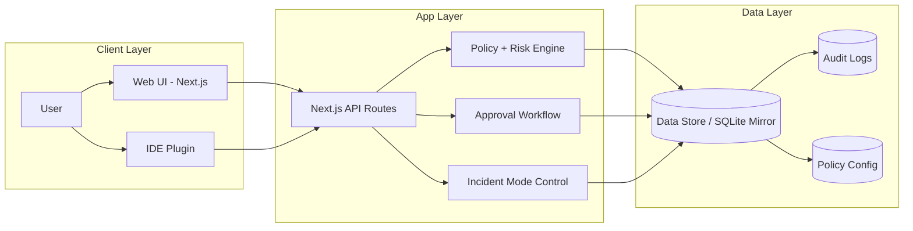
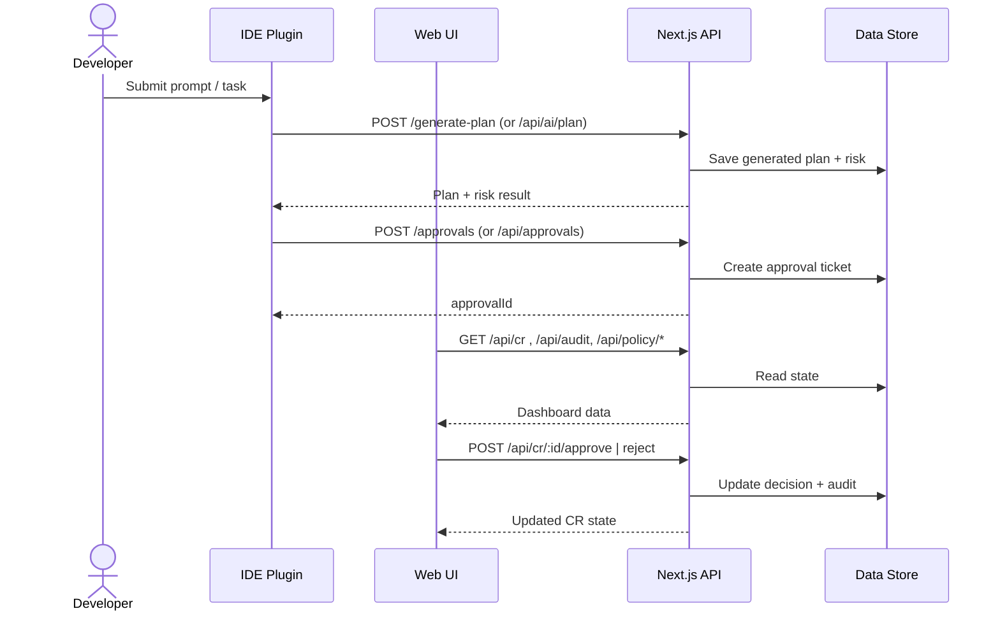
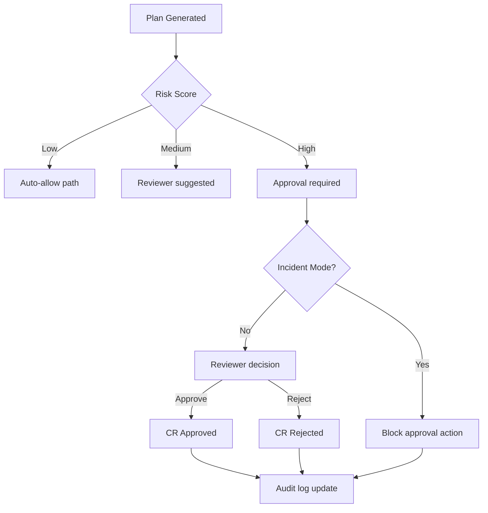
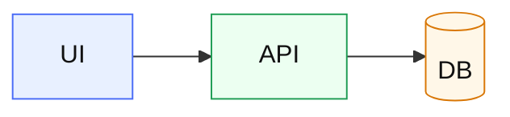

# HaLoop Architecture Diagram (Mermaid Guide)

This document provides ready-to-use Mermaid templates for HaLoop architecture diagrams.

## 1. How To Use

1. Copy any Mermaid block below.
2. Paste it into:
   - Mermaid Live Editor: `https://mermaid.live`
   - GitHub/GitLab Markdown (Mermaid-supported)
   - VS Code with Mermaid preview extension
3. Adjust node names and edges as your implementation evolves.

---

## 2. High-Level System Architecture



---

## 3. Frontend + Backend Interaction



---

## 4. Governance Decision Flow



---

## 5. API Surface Map (Current)

```mermaid
graph TD
    A[Client Apps] --> B[/generate-plan]
    A --> C[/approvals]
    A --> D[/approvals/:approvalId/decision]
    A --> E[/approvals/:approvalId/events]

    A --> F[/api/cr]
    A --> G[/api/cr/:id]
    A --> H[/api/cr/:id/approve]
    A --> I[/api/cr/:id/reject]
    A --> J[/api/cr/:id/request-changes]

    A --> K[/api/audit]
    A --> L[/api/policy/active]
    A --> M[/api/policy/path-rules]
    A --> N[/api/incident]
```

---

## 6. Styling Tips For Mermaid

Use classes to color subsystems:



---

## 7. Recommended Diagram Set For Documentation

1. **System Context Diagram**: user, plugin, web app, backend.
2. **Container Diagram**: frontend, API layer, policy engine, store.
3. **Sequence Diagram**: plan generation + approval path.
4. **Operational Flow**: incident mode behavior and decision blocking.

Use this file as the single source for diagram updates.

