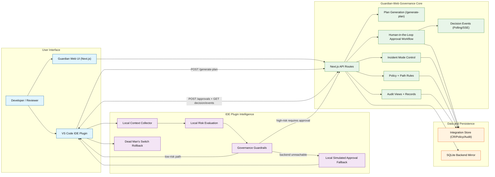

# HaLoop Architecture (Novelty-Focused)

This diagram highlights the innovative governance features documented in project READMEs:

- human-governed AI workflow
- local risk guardrails in the IDE plugin
- high-risk approval gating
- incident mode control
- Dead Man's Switch rollback
- audit visibility
- SQLite backend mirror compatibility

