# HaLoop Architecture

This Mermaid source reflects the current runtime architecture in this repository:

- IDE plugin context collection, local risk gating, apply, and rollback flow
- Guardian Web reviewer dashboard and governance APIs
- synchronous plugin planning plus async queued plan generation
- demo/prod persistence split with SQLite mirror compatibility
- OpenAI reliability, request tracing, incident control, and audit flow

```mermaid
flowchart LR
    DEV["Developer<br/>VS Code extension host"]
    REVIEWER["Reviewer / Admin<br/>Guardian Web"]

    subgraph IDE["IDE Plugin Runtime"]
        UI["Commands + Webview UI"]
        CTX["ContextCollector<br/>workspace, branch, active file, snippets"]
        CLIENT["AIClient"]
        GATE["RiskGate<br/>finalRisk = max(local, backend)"]
        APPROVAL_CLIENT["ApprovalClient<br/>POST /approvals + SSE/polling"]
        APPLY["ChangeApplier"]
        ROLLBACK["SessionStore + Dead Man's Switch"]
        LOCAL_FALLBACK["Local simulated approval fallback"]
    end

    subgraph WORKSPACE["Developer Workspace"]
        REPO["Repo files + Git state"]
    end

    subgraph SERVICE["Guardian Web Service"]
        DASH["Dashboard UI + React Query<br/>CR, policy, incident, audit views"]

        subgraph ROUTES["Next.js Routes"]
            PLUGIN_ROUTES["Plugin routes<br/>/generate-plan<br/>/approvals<br/>/approvals/:id/decision<br/>/approvals/:id/events"]
            REVIEW_ROUTES["Dashboard APIs<br/>/api/cr, /api/policy<br/>/api/incident, /api/audit"]
            AI_ROUTES["AI APIs<br/>/api/ai/plan<br/>/api/jobs/:id<br/>/api/openai/webhook"]
        end

        subgraph CORE["Planning + Governance Core"]
            POLICY["Policy engine<br/>path rules + thresholds"]
            EXEC["Plan execution / backendPlan"]
            OPENAI_REL["OpenAI reliability layer<br/>structured JSON, retries, background polling"]
            HEURISTIC["Heuristic planner fallback"]
            APPROVAL_CORE["Approval + CR workflow"]
            INCIDENT["Incident mode gate"]
            AUDIT["Audit + compact backend view"]
            STORE["dataStore adapter<br/>demo vs prod"]
        end
    end

    subgraph INFRA["Infra + External Services"]
        OPENAI["OpenAI Responses API"]
        REDIS["Redis + BullMQ<br/>queue, retries, dead-letter queue"]
        WORKER["planWorker"]
        TELEMETRY["Request IDs + OTel spans"]
    end

    subgraph DATA["Persistence"]
        DEMO["Demo mode<br/>JSON integration store"]
        SQLITE["SQLite mirror<br/>compatibility + compact audit"]
        POSTGRES["Prod mode<br/>Postgres via Prisma"]
    end

    DEV --> UI
    REPO --> CTX
    UI --> CTX --> CLIENT
    CLIENT -->|prompt + context| PLUGIN_ROUTES
    PLUGIN_ROUTES --> EXEC
    PLUGIN_ROUTES --> APPROVAL_CORE
    EXEC --> POLICY
    EXEC --> OPENAI_REL
    EXEC --> HEURISTIC
    OPENAI_REL --> OPENAI
    OPENAI_REL -.fallback.-> HEURISTIC
    EXEC --> STORE
    EXEC --> TELEMETRY
    PLUGIN_ROUTES -->|plan + backend risk| CLIENT
    CLIENT --> GATE
    GATE -->|low / medium| UI
    GATE -->|high risk| APPROVAL_CLIENT
    APPROVAL_CLIENT -->|create request / wait for decision| PLUGIN_ROUTES
    APPROVAL_CLIENT -.backend unavailable.-> LOCAL_FALLBACK
    LOCAL_FALLBACK --> UI

    UI -->|apply approved plan| APPLY
    APPLY --> REPO
    APPLY --> ROLLBACK
    ROLLBACK --> REPO

    REVIEWER --> DASH
    DASH <--> REVIEW_ROUTES
    REVIEW_ROUTES --> APPROVAL_CORE
    REVIEW_ROUTES --> POLICY
    REVIEW_ROUTES --> INCIDENT
    REVIEW_ROUTES --> AUDIT
    INCIDENT -.blocks reviewer approvals.-> APPROVAL_CORE
    APPROVAL_CORE -->|decision event| PLUGIN_ROUTES
    APPROVAL_CORE --> STORE
    APPROVAL_CORE -.demo mirror.-> SQLITE

    AI_ROUTES -->|small request| EXEC
    AI_ROUTES -->|async or long-running request| REDIS
    REDIS --> WORKER --> EXEC
    AI_ROUTES -->|job status lookup| REDIS
    OPENAI -.signed webhook.-> AI_ROUTES

    POLICY --> STORE
    INCIDENT --> STORE
    AUDIT --> STORE
    STORE --> DEMO
    STORE --> POSTGRES
    STORE -.demo mirror.-> SQLITE

    classDef actor fill:#e6f2ff,stroke:#1d5fa7,color:#111;
    classDef plugin fill:#f6ecff,stroke:#7a3db8,color:#111;
    classDef service fill:#ebf7ee,stroke:#2f7a43,color:#111;
    classDef infra fill:#fff1df,stroke:#b86a1f,color:#111;
    classDef data fill:#fff7d6,stroke:#9c7a00,color:#111;

    class DEV,REVIEWER actor
    class UI,CTX,CLIENT,GATE,APPROVAL_CLIENT,APPLY,ROLLBACK,LOCAL_FALLBACK plugin
    class DASH,PLUGIN_ROUTES,REVIEW_ROUTES,AI_ROUTES,POLICY,EXEC,OPENAI_REL,HEURISTIC,APPROVAL_CORE,INCIDENT,AUDIT,STORE service
    class OPENAI,REDIS,WORKER,TELEMETRY infra
    class DEMO,SQLITE,POSTGRES,REPO data
```

